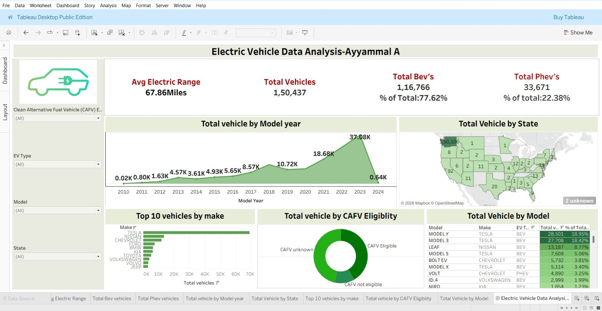

# ⚡ Electric Vehicle Data Analysis Dashboard

## 📌 Project Overview
This Tableau dashboard analyzes Electric Vehicle (EV) data to understand trends, growth, and market distribution across states and manufacturers.

---

## 📊 Key Metrics (KPIs)
- Average Electric Range
- Total Vehicles
- Total BEVs (Battery Electric Vehicles)
- Total PHEVs (Plug-in Hybrid Electric Vehicles)

---

## 📈 Visualizations Included
- Total Vehicles by Model Year (Line Chart – Trend Analysis)
- Total Vehicles by State
- Top 10 Vehicles by Make
- Total Vehicles by CAFV Eligibility
- Total Vehicles by Model

---

## 🎛 Filters Used
- Model Year
- State
- Make
- CAFV Eligibility

These filters allow dynamic analysis and interactive exploration of the data.

---

## 🛠 Tool Used
- Tableau

---

## 📷 Dashboard Preview

# Electric-Vehicle-Data-Analysis-Dashboard--Tableau
